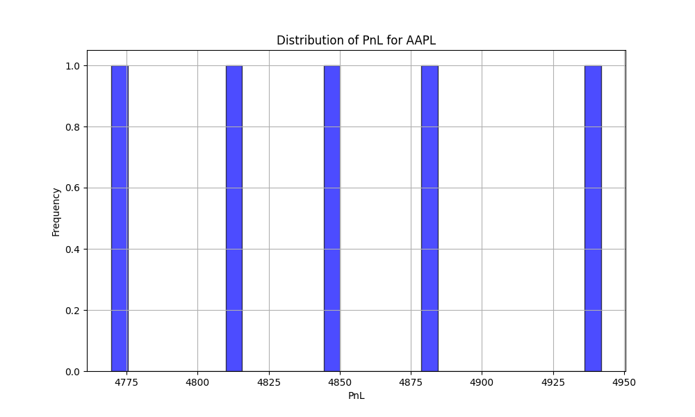
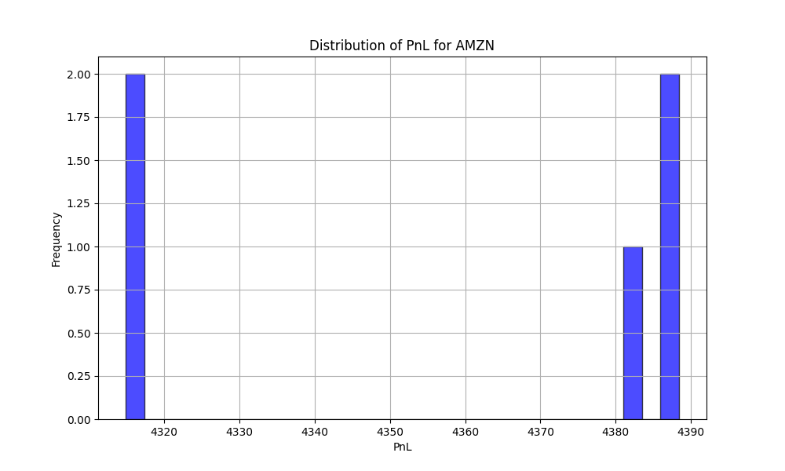
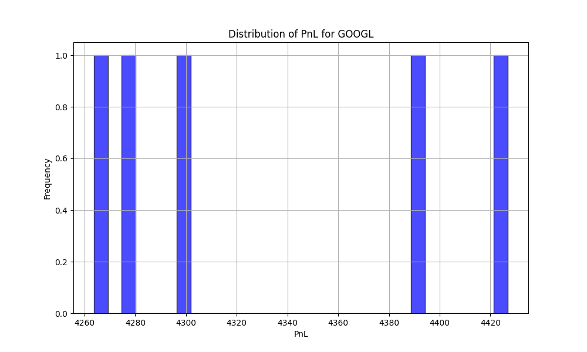
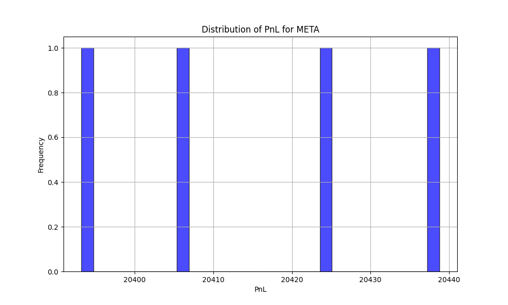
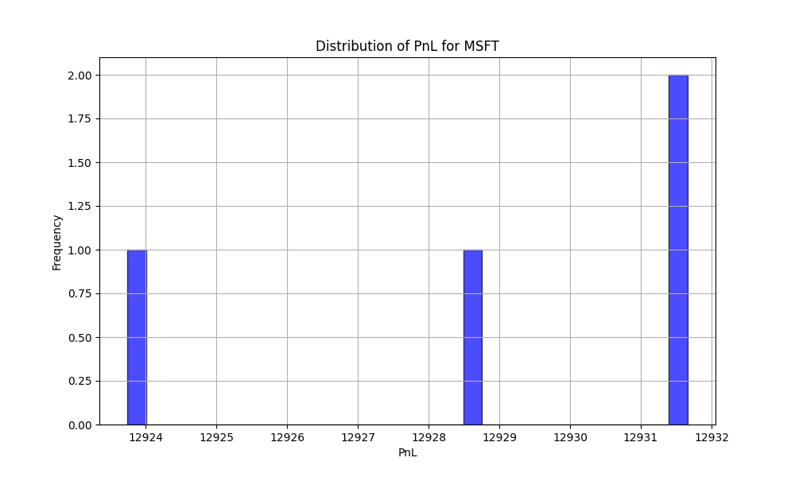
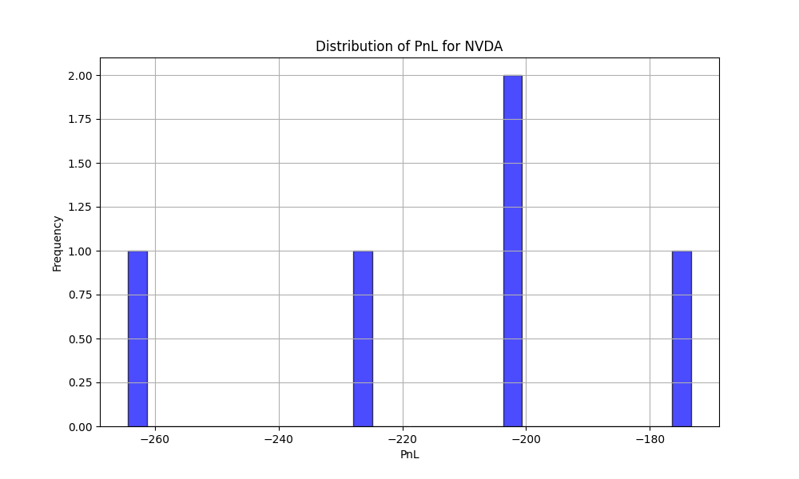
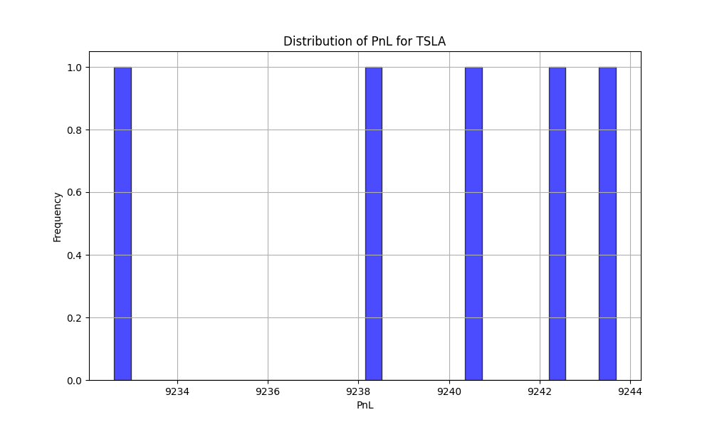

# Reinforcement Learning Agent for Intraday Execution Optimization

A cutting-edge quantitative finance project leveraging reinforcement learning (RL) techniques for optimizing intraday trade execution. This framework implements a Double Deep Q-Network (DQN) agent in a simulated limit order book environment, incorporating latency modeling, slippage costs, and advanced risk analytics including Monte Carlo simulations for PnL distribution, Value-at-Risk (VaR), and Conditional Value-at-Risk (CVaR).

## 🚀 Key Features

- **Reinforcement Learning Implementation**: Double DQN with epsilon-greedy exploration, target network synchronization, and experience replay for stable training.
- **Quantitative Finance Focus**: Intraday execution optimization with realistic market simulations including latency sampling and slippage modeling.
- **Risk Management**: Comprehensive Monte Carlo backtesting for probabilistic PnL analysis, VaR, and CVaR calculations.
- **Visualization & Logging**: Comprehensive logging for monitoring rewards, latency metrics, and training progress.
- **Modular Architecture**: Clean separation of environment, agent, training, and evaluation components for scalability and maintainability.
- **Multi-Ticker Support**: Evaluated on major tech stocks including AAPL, AMZN, GOOGL, META, MSFT, NVDA, and TSLA.

## 🛠 Technologies Used

- **Programming Language**: Python 3.x
- **Machine Learning Framework**: PyTorch for neural network implementation
- **Reinforcement Learning Library**: Custom Gym-compatible environment
- **Data Processing**: Pandas, NumPy for financial data handling
- **Visualization**: Matplotlib, Seaborn for plotting PnL distributions and metrics
- **Logging & Monitoring**: Custom logging for experiment tracking
- **Version Control**: Git for collaborative development

## 📊 Evaluation Results

The agent has been evaluated on real tick data for seven major technology stocks. Below are the Monte Carlo simulation results showing PnL distributions for each ticker:

### AAPL (Apple Inc.)
| Metric | Value |
|--------|-------|
| Mean PnL | 4887.79 |
| Std PnL | 64.09 |
| VaR(5%) | 4802.11 |



### AMZN (Amazon.com Inc.)
| Metric | Value |
|--------|-------|
| Mean PnL | 4399.75 |
| Std PnL | 62.70 |
| VaR(5%) | 4292.34 |



### GOOGL (Alphabet Inc.)
| Metric | Value |
|--------|-------|
| Mean PnL | 4384.85 |
| Std PnL | 73.57 |
| VaR(5%) | 4242.64 |



### META (Meta Platforms Inc.)
| Metric | Value |
|--------|-------|
| Mean PnL | 20419.25 |
| Std PnL | 12.51 |
| VaR(5%) | 20399.25 |



### MSFT (Microsoft Corporation)
| Metric | Value |
|--------|-------|
| Mean PnL | 12928.63 |
| Std PnL | 7.49 |
| VaR(5%) | 12916.36 |



### NVDA (NVIDIA Corporation)
| Metric | Value |
|--------|-------|
| Mean PnL | -252.08 |
| Std PnL | 39.11 |
| VaR(5%) | -320.29 |



### TSLA (Tesla Inc.)
| Metric | Value |
|--------|-------|
| Mean PnL | 9238.43 |
| Std PnL | 5.23 |
| VaR(5%) | 9230.23 |



Each plot represents the distribution of Profit and Loss from 1000 Monte Carlo simulations, providing insights into the agent's performance under various market conditions.

## 📂 Project Structure

```
Reinforcement-Learning-Agent-for-Intraday-Execution-Optimization/
├── agent/                 # RL agent implementations (DQN)
├── data/                  # Financial tick data and data generation scripts
├── eval/                  # Evaluation scripts for backtesting and Monte Carlo simulations
├── models/                # Saved model checkpoints
├── results/               # Evaluation results and plots
├── train/                 # Training scripts with TensorBoard logging
├── utils/                 # Utility functions for metrics, logging, and visualization
├── main.py                # Main entry point for CLI operations
├── requirements.txt       # Python dependencies
└── README.md              # Project documentation
```

## 📦 Installation

1. Clone the repository:
```bash
git clone https://github.com/yourusername/Reinforcement-Learning-Agent-for-Intraday-Execution-Optimization.git
cd Reinforcement-Learning-Agent-for-Intraday-Execution-Optimization
```

2. Install dependencies:
```bash
pip install -r requirements.txt
```

## 🛠 Usage

### Train the Agent
Train a new DQN agent on financial tick data:
```bash
python main.py --mode train --data data/AAPL_real_tick_data.csv --episodes 500
```

### Evaluate Single Episode
Run a single evaluation episode:
```bash
python main.py --mode eval --data data/AAPL_real_tick_data.csv --model models/DQN/double_dqn.pth
```

### Monte Carlo Backtesting
Perform Monte Carlo simulations for risk analysis:
```bash
python main.py --mode eval_mc --data data/AAPL_real_tick_data.csv --model models/DQN/double_dqn.pth --sims 1000
```

### Multi-Ticker Evaluation
Evaluate across multiple tickers with plots:
```bash
python eval/run_eval_mc_portfolio_with_plots.py
```

## 📈 Skills Demonstrated

- **Machine Learning & AI**: Deep Reinforcement Learning, Neural Networks, PyTorch
- **Quantitative Finance**: Algorithmic Trading, Risk Management, Monte Carlo Methods
- **Software Engineering**: Modular Code Design, CLI Development, Version Control
- **Data Analysis**: Financial Data Processing, Statistical Modeling, Visualization
- **Research & Development**: Experiment Design, Performance Optimization, Technical Writing

## 🤝 Contributing

Contributions are welcome! Please feel free to submit a Pull Request or open an Issue for bugs, feature requests, or improvements.

## 📄 License

This project is licensed under the MIT License - see the LICENSE file for details.

## 📧 Contact

For questions or collaborations, please reach out via GitHub Issues or email at kennethlegare5@gmail.com.
